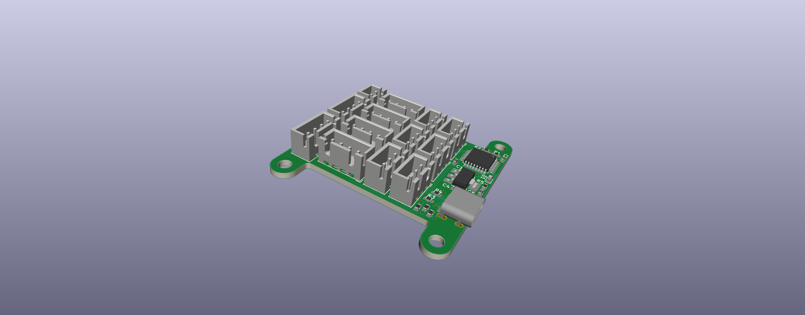

# robot control panel

## Description
The main goal of this project is to create a framework for building mechanism-specific control devices. An example is a robotic arm controller that is a scaled down version of the arm itself. Similarities between the controller and the mechanism can make for a more effective controller and can also flatten the learning curve.

### Mainboard
The mainboard is a generic STM32 based breakout with USB Type-C. It has 6 analog and 12 digital inputs, in addition to two I2C ports. This board can be used to build any kind of controller because it does not have any specific hardware.

### Testing software
The testing software is a basic webapp that simulates a 'robot' with basic drag and friction. The idea was to create something that is not entirely unlike driving an actual robot. Then, a number of points are scattered on the screen in a random pattern. The goal is to pass through all of them in a certain order as fast as possible, like the actual robot driving test.

[Video](https://www.youtube.com/watch?v=zxHl_gj8LcE)

### Controller
I think that the ideal physical controller design centers around the idea of one person controlling the whole robot. I think that having multiple drivers splits a task that is doable by one person over two people who cannot communicate perfectly. If one person could control both the drive system and the manipulators at the same time with good dexterity, it would be possible to coordinate motions much more efficiently. The problem is that Xbox controllers are not ideal, so trying to fit all of these controls on one controller is not worth it.

Additionally, this isn't just a hardware problem. I think that the proper use of abstraction on the robot code side can drastically reduce the amount of input necessary from the driver. It is true that this can take away a sense of full control that the driver likes to have, but I feel like this can be easily solved with practice and optimization. Remember that this optimization is toward the goal of having one person drive the robot alone, which would be very beneficial.

Although software optimization only takes one so far. The controller itself is where the most optimizations can be made. Through some code improvements, it should be possible to drive only with one stick. Then, this other stick can be used specifically for manipulators, which can be selected through some button combination. Or, this second stick could be swapped out with some mechanism specific to some manipulator. This board supports anything with potentiometers.

The controller I designed uses RC transmitter joysticks in place of the smaller joysticks on Xbox controllers. The larger joysticks have better accuracy due to their increased travel but at the expense of time to reach an extreme. The increased travel is possibly more important because these sticks are meant to be used with any number of different manipulators. There are swappable button plates on the back.

There are no mechanism specific control devices in this controller, but they could easily be added with a few new parts. An elevator, for example, could be controlled by a joystick that does not have the Y axis spring, so that its motion mimics the motion of the elevator. Or it could be entirely swapped out. 

### Improvements
I don't think there are many improvements to be made on the mainboard. It's pretty simple and it worked on the first try. The ADC is not too noisy and the digital inputs/I2C have no problems.

The testing software is too simplistic. It doesn't test manipulators and has no way to test button-joystick coordination. A second revision would probably have a better (maybe 3D) simulation of a game field complete with better physics and collision detection. There really isn't a better way to test these controllers other than actually trying to simulate the thing they will be used for. This would require almost a complete rewrite.

The controller itself is rudimentary. If this were designed with an actual robot in mind, it would probably look nothing like this. I just wanted something that demonstrated the concepts I was going for. I would start from scratch if I were to redo this controller for some robot.
