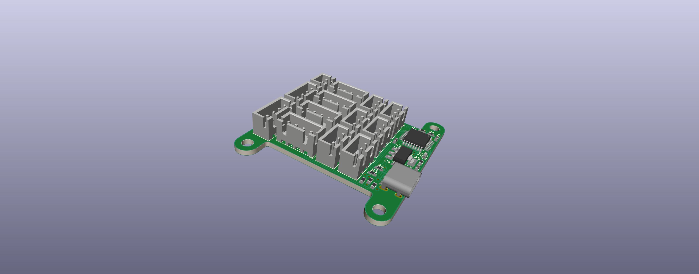
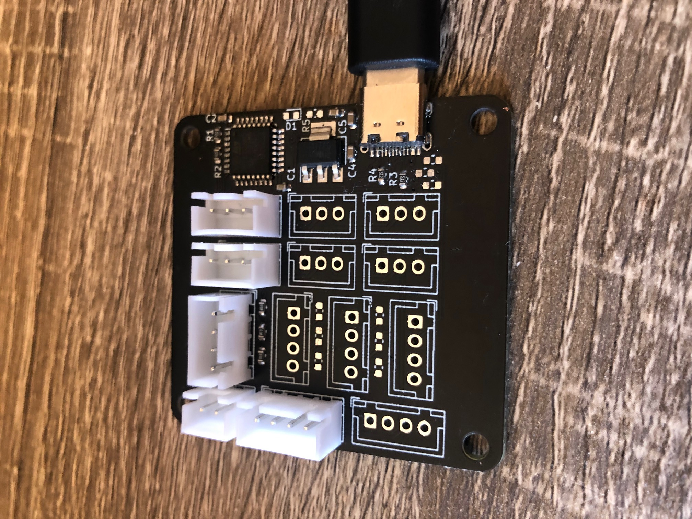

# Mainboard

This is the main board for the control panel. It is a [STM32F042K6T6](https://lcsc.com/product-detail/ST-Microelectronics_STMicroelectronics_STM32F042K6T6_STM32F042K6T6_C69216.html) with a [USB Type-C Connector](https://lcsc.com/product-detail/USB-Type-C_TYPE-C-31-M-12-Female-16P-SMD_C165948.html) and 12 analog/digital I/O pins broken out with JST-XH connectors. It also has two I2C connectors and a separate power connector that goes straight to the regulator that supports up to 15v input.

